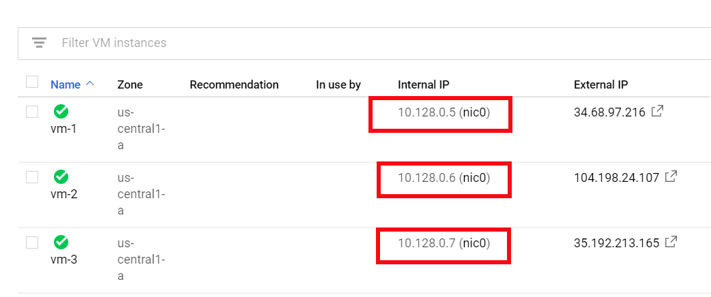
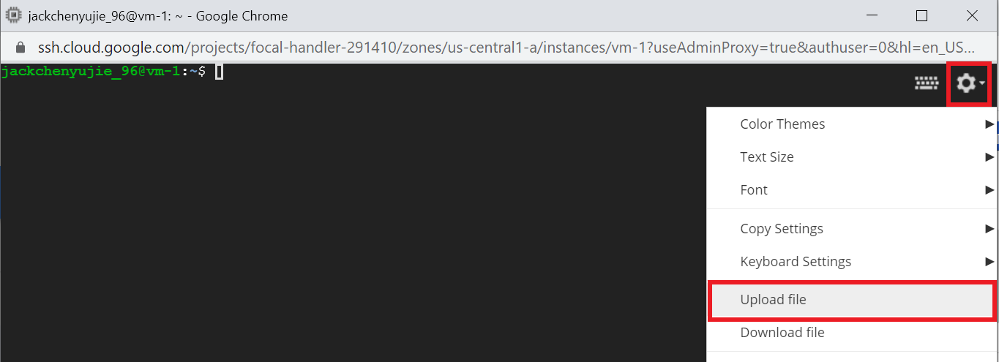
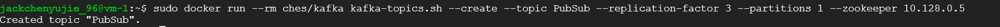
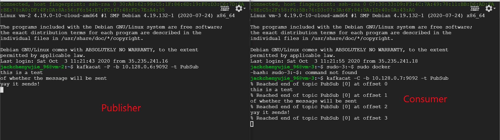
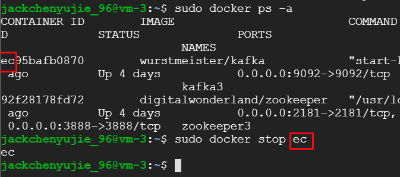
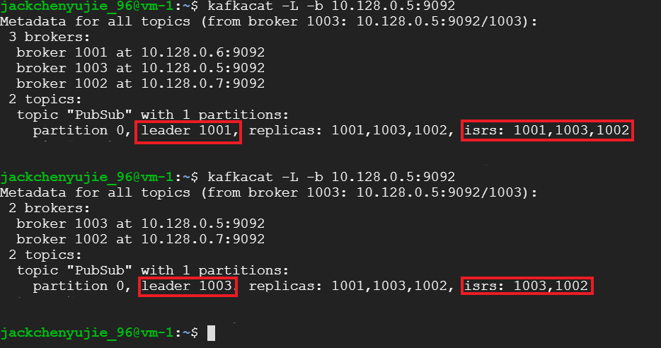

# CS3219 OTOT Assignment Task D: Kafka Cluster & Zookeeper Ensemble

## Jack Chen Yu Jie


## Task

To create a **3-node Apache Kafka cluster** using Docker that demonstrates Pub-Sub messaging, with a **Zookeeper ensemble** created to manage Kafka cluster


## Servers Setup

Set up 3 Kafka nodes and Zookeeper nodes to be deployed in **3 different servers**. Each server will run a single Kafka and Zookeeper node. We can create 3 servers using any of the Cloud Computing Service provider such as Microsoft Azure.

In my example, a total of 3 Ubuntu VMs are set up using *__Google Cloud Platform__*. We can then `ssh` into the VM by clicking SSH which will give a command terminal of the VM instance. The internal IP address can be found in the ***VM instances*** page as shown in the screenshot below.



Below are the (internal) IP addresses for my example:

```C
// VM1
10.128.0.5
// VM2
10.128.0.6
// VM3
10.128.0.7
```


### Setting up dependencies 

Once you are in the command-line of the VM, we can get the packages that we need to complete the task using the following commands:

`sudo apt-get install docker docker-compose kafkacat`

We need to first install `docker`, then install `docker-compose` which is used to set up containers. `kafkacat` is a command line client for interaction with `kafka`. 

**Do this for all 3 VMs.**


## Setting up Kafka and Zookeeper nodes in VMs

1. First fork and clone this repo or just download the `docker-compose.yml` file onto your local machine. 

2. Replace the fields marked within `{}` with the appropriate VM's IP Addresses (Internal IP Address). An example is shown in `docker-compose_example.yml`

3. Upload this file to all of the three VM instances by clicking the **settings button on the top right corner of the CLI > Upload file** as shown in the screenshot below

   

4. Start the Zookeeper and Kafka node using the `docker-compose.yml` file that was copied into the VMs using the following commands in this order:

```c
//Server 1
sudo docker-compose up -d zookeeper1 kafka1

//Server 2
sudo docker-compose up -d zookeeper2 kafka2

//Server-3
sudo docker-compose up -d zookeeper3 kafka3
```

5. After setting up the Zookeeper and Kafka nodes in each of the VMs, we can now demonstrate the Pub-Sub messaging system using Apache Kafka


## Demonstration of Pub-Sub messaging system using Apache Kafka

After setting up the Zookeeper and Kafka nodes in all 3 servers. We can now create a topic for the Pub-Sub messaging

1. Create the topic. Set `replication-factor`to more than 1 for the fail-safe mechanism to work so that when the master node fails, another node in the cluster can take over. The `replication-factor ` defines the number of copies of a topic in a Kafka cluster. `{VM_IPAddress}`can be any of the 3 VM's IP address. We use the internal IP addresses of the VMs which can be found on the ***VM instances*** homepage as shown earlier in [Servers Setup](#servers-setup).

   ```
   sudo docker run --rm ches/kafka kafka-topics.sh --create --topic {topic_title} --replication-factor 3 --partitions 1 --zookeeper {VM_IPAddress}
   ```

   For my example, I created `PubSub` topic using my first VM's IP address as follows:

   ```
   sudo docker run --rm ches/kafka kafka-topics.sh --create --topic PubSub --replication-factor 3 --partitions 1 --zookeeper 10.128.0.5
   ```

   

2. If the topic is created successfully, it should show the message as shown in below: 

   We can also check to see if the topic has been successfully created using the command below, where `VM_IPAddress` is the IP Address that used above.

   ````
   kafkacat -L -b {VM_IPAddress}:9092
   ````
   
     For my example, I used:
   
   ```
   kafkacat -L -b 10.128.0.5:9092
   ```

   

3. We can start sending messages by creating at least 1 consumer and 1 publisher. Use the other 2 VMs to do this. (one for publisher, one for consumer)

   ````c
   // Create publisher
   kafkacat -P -b {VM_IPAddress}:9092 -t {topic_title_created}
   
   // Create Consumer
   kafkacat -C -b {VM_IPAddress}:9092 -t {topic_title_created}
   ````
   
     For my example, I used:
   
   ```C
   // Create publisher for VM
   kafkacat -P -b 10.128.0.6:9092 -t PubSub
      
   // Create Consumer
   kafkacat -C -b 10.128.0.7:9092 -t PubSub
   ```


 

4. The publisher can type messages in the publisher terminal and see it appear on the consumer's terminal as shown in the screenshot below.

   We can see that the left VM (***publisher***) takes in user input and publish them to Kafka.  The right VM (***consumer***) takes the messages from the topic and outputs them into the command line. 

   

   

   

   ### Successful management of failure of master node in the cluster

   For topics created with `replication-factor` of more than 1, when the leader node is down, one of the remaining kafka brokers will take over as the leader node. The order of taking over can be seen by `isrs` as shown in the last screenshot below. 
   
   To view this metadata, execute the command `kafkacat -L -b {VM_IPAddress}:9092` as before.

To illustrate the taking over of leader node, we first have to stop the current leader node by executing `sudo docker stop {container_id}` where `{container_id}` is the **id of the** **kafka container** of the leader node/VM. (*Note: you can simply type a subset of the full `container_id` . An example of stopping a process using this method is shown below.*)
   
   

   We then run the command `kafkacat -L -b {VM_IPAddress}:9092` again to show that one of the other nodes has taken over as the leader node. (*Note that you can only use the IP addresses of the other VM(s) with running Kafka containers, hence you cannot use the IP address of the leader node you just terminated*)
   
   As seen in the screenshot, the leader of `PubSub` topic was initially `broker 1001` which was the 2nd VM (`10.128.0.6:9092`) and when we stop the docker container in our 2nd VM, we can see that listing the topics again show that the leader is now `broker 1003` (`10.128.0.5:9092`) which is our 1st VM.
   
   
   

